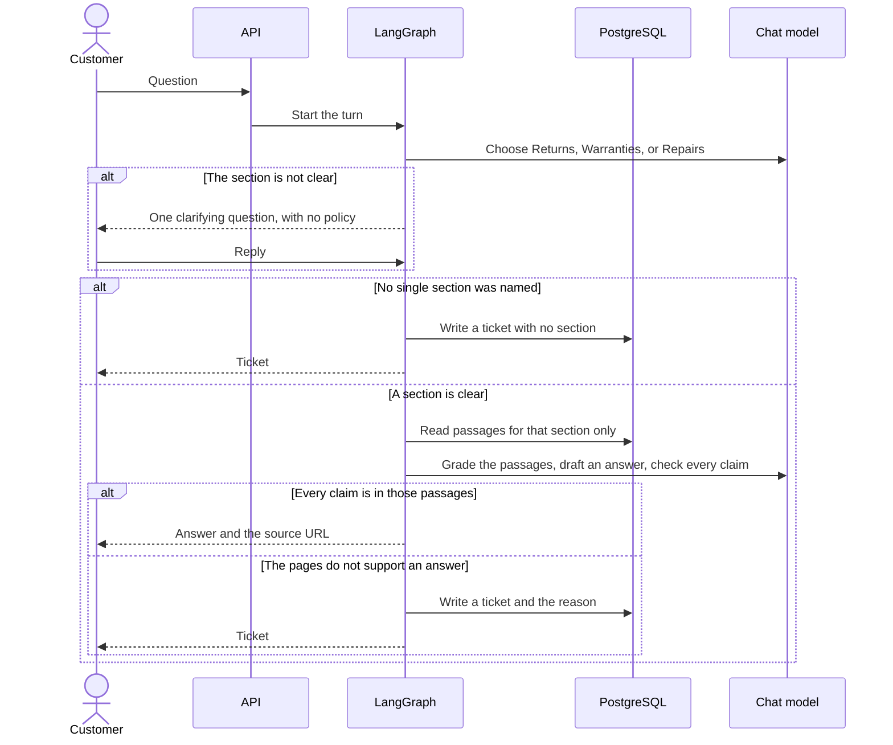

# Alpha design

This is the shape the Alpha is built from. The acceptance rules stay in [discovery.md](discovery.md). How that shape is coded, which library plays each part, and how the work sits in discovery, Alpha, UAT, and rollout, is planned in [build.md](build.md). Three views are drawn here: who uses Deskline, what is deployed, and what happens to one question. The components inside the API container are drawn in the build plan. A class diagram is left until the code exists.

The Halfords extracts are a local, gitignored input. They are not a container that is deployed.

## 1. Context

Deskline is the system in the centre. The customer and section staff are people. The Halfords website and the model provider stay outside it.

## 2. Containers

Four containers are built in the Alpha. All of them run on the local machine under Docker, except the JSON files, which are a folder on disk, and the model provider, which stays outside.

| Container | Responsibility in the Alpha |
|---|---|
| API | Receives a text question and returns a cited answer, one clarifying question, or a ticket. |
| LangGraph application | Owns the route, the single clarifying question, retrieval, the grounding check, and the ticket. It runs inside the API process. |
| PostgreSQL | Stores sections, chunks, and tickets. Retrieval is filtered by `section_id`. |
| Eval runner | Runs the frozen golden set and RAGAS by hand. It calls the same graph. It is not on the customer path. |

`data/corpus/*.json` is the ingest input. Each file holds the section id, the source URL, and the page text as published. After ingest, passages live in PostgreSQL on the same machine. The JSON is listed in `.gitignore`.

Azure is the same shape later: the API on Container Apps, PostgreSQL on Azure Database for PostgreSQL, and the model key in Key Vault. That deployment waits until local UAT has been passed. The Halfords JSON and the chunk text are not uploaded.

Records stored in PostgreSQL:

| Record | Held fields |
|---|---|
| Section | id, name. The ids are `returns`, `warranties`, and `repairs`. |
| Chunk | section id, source URL, passage text, embedding. |
| Ticket | section id if a section was chosen, question, passage ids, reason. |
| Eval run | what was changed, faithfulness, context precision. Written by the eval runner. |

## 3. One question

One sequence is the life of one question. It covers the four endings from discovery: a route, a citation, one clarifying question, and a ticket. Only one path is taken. Each `alt` is a fork, and the customer finishes on one of three results: a clarifying question, a cited answer, or a ticket.

| Participant | Role in this sequence |
|---|---|
| Customer | Sends the text. |
| API | Accepts the question and returns whatever the graph decided. The front door. |
| LangGraph | Owns the decisions: which section, whether to ask once, whether the pages support an answer, and whether to stop. |
| PostgreSQL | Holds the passages and the tickets. It does not choose a section. |
| Chat model | Picks a section, drafts an answer, and checks that every claim is in the passages. |

The reply arrow is drawn straight back to the graph. In the running system that reply still enters through the API. The diagram skips that hop so the turn stays readable.

### The path

1. **The question arrives.** The customer sends it to the API. The API starts one turn in the graph.
2. **The model names a section, or it does not.** The graph asks the model to choose Returns, Warranties, or Repairs. When the section is already clear, this step is the whole of the routing and the clarifying question is skipped. “Can I get a full refund on a bike I have already ridden?” belongs to Returns, so Deskline asks nothing else. When the section is not clear, the graph sends one clarifying question and states no policy. “The bike is damaged, what can you do?” could be a return, a warranty claim, or a repair. The customer replies once. A second clarifying question is never sent.
3. **A section has been named, or it has not.** When no single section was named, the graph writes a ticket with no section and returns that ticket. The turn ends. The reply may be “I don’t know,” or the question may be a job application. When a section is clear, the graph reads passages for that section only. A Returns question is answered from Returns passages alone.
4. **The model tries to answer from those passages only.** It grades them, drafts an answer, and checks every claim. When every claim is in those passages, the customer receives the answer and the source URL. When the pages do not support an answer, the graph writes a ticket that includes the reason, and returns the ticket. Repairs says a chargeable repair exists, and no page states the price. Deskline does not invent the price.

A ticket is the stop in both of those cases: the section never became clear, or the right section’s pages do not contain the answer.

### What the customer receives

| Situation | What comes back |
|---|---|
| The section is unclear on the first try | One clarifying question, then the turn waits for the reply |
| The reply still names no section | A ticket with no section |
| The section is clear and the pages support the answer | The answer and the source URL |
| The section is clear and the pages do not support the answer | A ticket for that section, with the reason |

## What is built first

The sequence above is built end to end before Azure and before a second interface. The first cut is one section, one cited answer, one clarifying question, and one ticket, with the JSON kept out of git. The leak test and the RAGAS run are added once that path exists. UAT is the script in [discovery.md](discovery.md).
