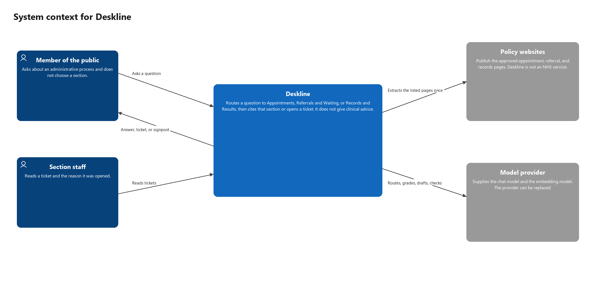
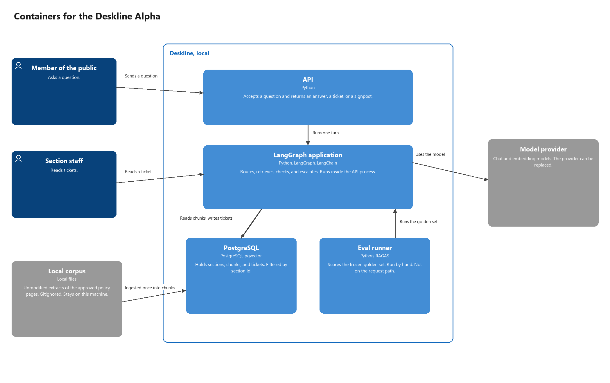
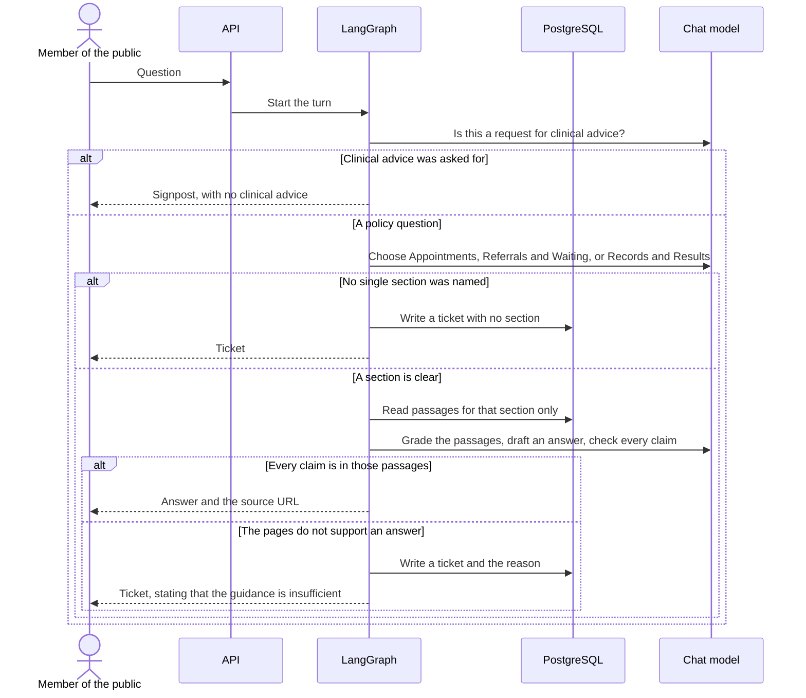

# Alpha design

This is the shape the Alpha is built from. The acceptance rules stay in [discovery.md](discovery.md). How that shape is scored is in [evaluation.md](evaluation.md). How that shape is coded, which library plays each part, and how the work sits in discovery, Alpha, UAT, and rollout, is planned in [alpha_build.md](alpha_build.md). Three views are drawn here: who uses Deskline, what is deployed, and what happens to one question. The components inside the API container are drawn in the build plan. A class diagram is left until the code exists.

The policy extracts are a local, gitignored input. They are not a container that is deployed. Swapping the domain does not change this shape. A section is still one corpus and one ticket queue. The section ids are now `appointments`, `referrals_waiting`, and `records_results`.

## 1. Context

Deskline is the system in the centre. The member of the public and section staff are people. The publishers of the policy pages and the model provider stay outside it. Deskline is not an NHS service.

## 2. Containers

Four containers are built in the Alpha. All of them run on the local machine under Docker, except the corpus files, which are a folder on disk, and the model provider, which stays outside.

| Container | Responsibility in the Alpha |
|---|---|
| API | Receives a text question and returns a cited answer, a ticket, or a clinical signpost. |
| LangGraph application | Owns the clinical refusal, the route, retrieval, the grounding check, and the ticket. It runs inside the API process. |
| PostgreSQL | Stores sections, chunks, and tickets. Retrieval is filtered by `section_id`. |
| Eval runner | Runs the frozen golden set and RAGAS by hand. It calls the same graph. It is not on the request path. |

`data/corpus/<section>/` is the ingest input. Each file holds the page text as published. The section id and the source URL also live in the metadata row under `data/metadata/`. After ingest, passages live in PostgreSQL on the same machine. The corpus files are listed in `.gitignore`. The metadata is not.

Azure is the same shape later: the API on Container Apps, PostgreSQL on Azure Database for PostgreSQL, and the model key in Key Vault. That deployment waits until local UAT has been passed. The policy extracts and the chunk text are not uploaded.

Records stored in PostgreSQL:

| Record | Held fields |
|---|---|
| Section | id, name. The ids are `appointments`, `referrals_waiting`, and `records_results`. |
| Chunk | section id, source URL, passage text, embedding. |
| Ticket | section id if a section was chosen, question, passage ids, reason. |
| Eval run | what was changed, routing accuracy, faithfulness, context precision, citation correctness, unsupported-answer rate. Written by the eval runner. |

## 3. One question

One sequence is the life of one question. It covers the endings from discovery: a clinical signpost, a route, a citation, and a ticket. Only one path is taken. Each `alt` is a fork. The person finishes on one of three results: a signpost, a cited answer, or a ticket.

| Participant | Role in this sequence |
|---|---|
| Member of the public | Sends the text. |
| API | Accepts the question and returns whatever the graph decided. The front door. |
| LangGraph | Owns the decisions: whether the question is clinical, which section, whether the pages support an answer, and whether to stop. |
| PostgreSQL | Holds the passages and the tickets. It does not choose a section. |
| Chat model | Picks a section, drafts an answer, and checks that every claim is in the passages. It does not decide that a failed check may still be shown. |

### The path

1. **The question arrives.** The person sends it to the API. The API starts one turn in the graph.
2. **Clinical advice is refused before any policy answer.** The graph asks whether the question seeks a diagnosis, a treatment, or an interpretation of symptoms or results. “What does this test result mean for me?” is that case. Deskline signposts to an appropriate healthcare professional or service and states no clinical advice. The turn ends.
3. **The model names a section, or it does not.** The graph asks the model to choose Appointments, Referrals & Waiting, or Records & Results. “How can I change my hospital appointment?” belongs to Appointments. “I’ve been referred but haven’t heard anything about my appointment” could be a referral, a wait, or an appointment, so no single section is named. A cross-domain question such as “My GP referred me for a test and I can’t see the result online” is not answered from two sections at once. The person is not asked to choose.
4. **A section has been named, or it has not.** When no single section was named, the graph writes a ticket with no section and returns that ticket. The turn ends. The question may be ambiguous, or it may be a job application. When a section is clear, the graph reads passages for that section only. An Appointments question is answered from Appointments passages alone.
5. **The model tries to answer from those passages only.** It grades them, drafts an answer, and checks every claim. When every claim is in those passages, the person receives the answer and the source URL. When the pages do not support an answer, the graph writes a ticket that includes the reason, and returns the ticket. The reply says the guidance is insufficient. A page may describe a waiting process and not state the wait at a named hospital. Deskline does not invent the wait.

A ticket is the stop when the section is not clear, or when the right section’s pages do not contain the answer. A clinical signpost is a separate stop, taken before routing.

### What the person receives

| Situation | What comes back |
|---|---|
| The question asks for clinical advice | A signpost, and no clinical advice |
| The section is not clear | A ticket with no section |
| The section is clear and the pages support the answer | The answer and the source URL |
| The section is clear and the pages do not support the answer | A ticket for that section, stating that the guidance is insufficient |

## What is built first

The corpus is gathered before application code. The sequence above is then built end to end before Azure and before a second interface. The first code cut is one section, one cited answer, then routing, a ticket, and the clinical signpost, with the extracts kept out of git. The leak test and the RAGAS run are added once that path exists. UAT is the script in [discovery.md](discovery.md), scored as in [evaluation.md](evaluation.md).
