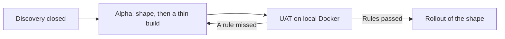
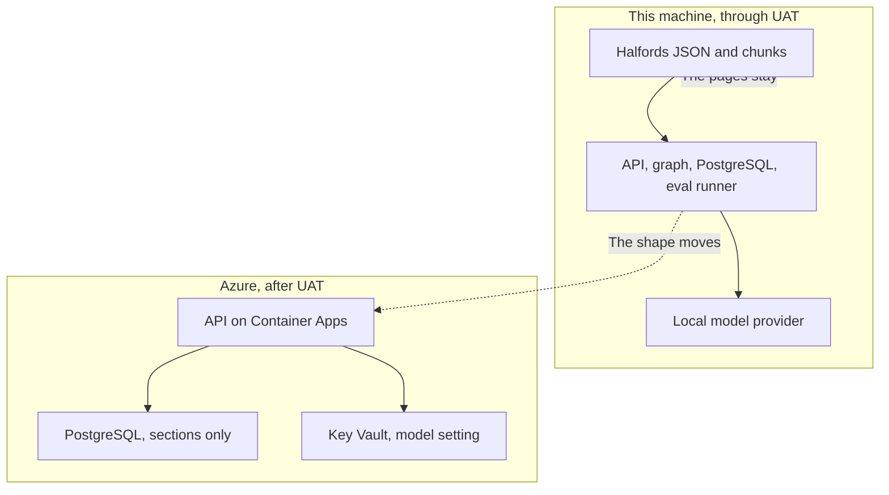
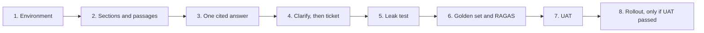
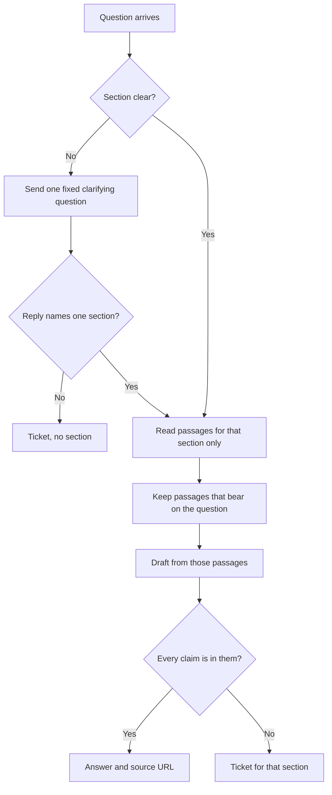
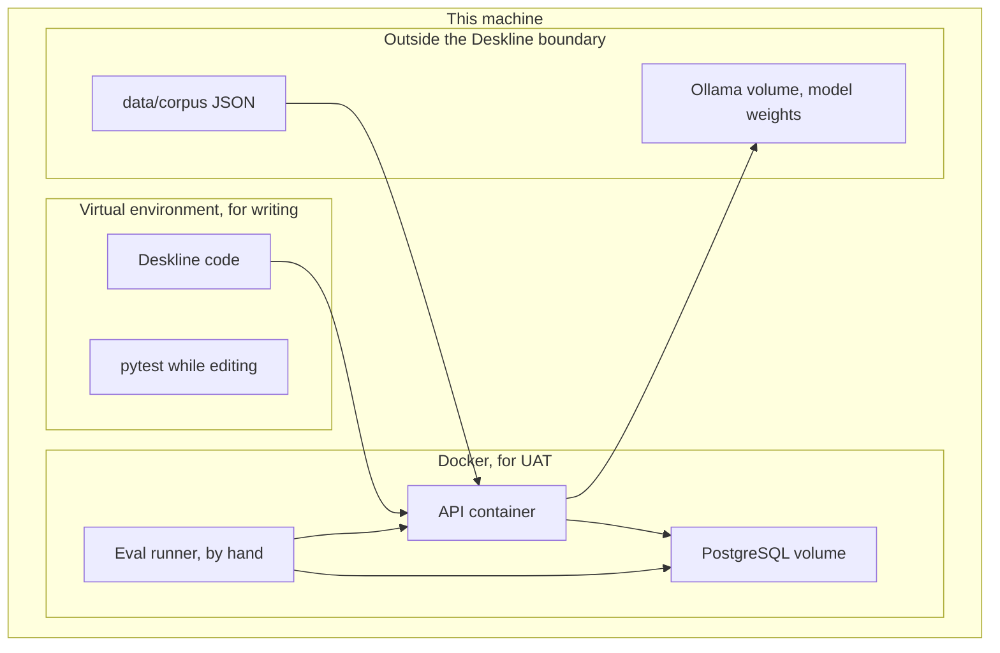

# Alpha build plan

This is how Deskline is built. It does not replace [discovery.md](discovery.md) or [alpha.md](alpha.md). Discovery says what is solved and how UAT judges it. Alpha says who uses Deskline, what is deployed, and what happens to one question. This plan says which component does each of those jobs, which library is used, and why.

No application code is written from this document. The steps below are the order the code will follow.

The plan is a separate file on purpose. Alpha stays the picture of the system. Folding libraries, the virtual environment, and the phase gates into that picture would mix the shape with the workshop.

## 1. The four stages

UK digital services, in the GOV.UK Service Manual, move through four phases: Discovery, Alpha, Beta, and Live. UAT is not one of those phases. It is the acceptance check a team runs before it treats a phase as passed. Rollout is not one of those phases either. It is the move of a service that has passed its check into the place it will run.

Deskline uses the same ideas, with the names already used in discovery and alpha.

| Stage | Service Manual phase it matches | What this project does | Where it is written |
|---|---|---|---|
| Discovery | Discovery | The problem, the three sections, the users, and the acceptance rules are closed. | [discovery.md](discovery.md) |
| Alpha | Alpha | The shape is drawn, then a thin Deskline is built on this machine and tried against those rules. | [alpha.md](alpha.md) and this plan |
| UAT | The check at the end of Alpha | The golden set, the leak test, and one RAGAS run are executed under Docker. A miss continues Alpha. It does not start rollout. | Success criteria in discovery |
| Rollout | The start of a later Beta, not Live | The same containers are placed on Azure after UAT has passed. The Halfords pages are not part of that placement. | Constraints in discovery, container note in alpha |



Discovery is already closed. This plan is the Alpha build. UAT is the script in discovery: route labels, two-turn clarifying cases, the leak test, and one RAGAS run on the frozen golden set. The faithfulness bar is 0.8, set before tuning. If the first honest run misses it, UAT has failed and Alpha continues. The bar stays where it is. The golden questions stay as they were written.

Rollout waits until that local UAT has passed. It copies the application shape: the API on Container Apps, PostgreSQL on Azure Database for PostgreSQL, and a model setting in Key Vault. It does not copy the Halfords JSON, the chunk text, or the embeddings. A cloud copy of the page text is outside the permission recorded in discovery. The Azure database at rollout can hold the empty section rows. It does not hold the corpus, so that deployment does not answer Halfords questions. It proves the containers still fit together.



## 2. What is built, in order

Alpha’s rule is that one question works end to end before Azure and before a second interface. The first cut is one section, one cited answer, one clarifying question, and one ticket. The leak test and the RAGAS run are added once that path exists.



| Step | Built | Passed when |
|---|---|---|
| 1. Environment | The virtual environment, Docker Compose, PostgreSQL with pgvector, and the local model provider | A container starts, and the model answers a prompt that contains no Halfords text |
| 2. Sections and passages | The three section rows, one ingest of the gitignored JSON, chunks stored with `section_id` | A Returns passage can be read back with the Returns id |
| 3. One cited answer | Route, retrieve, grade, draft, check, for a question whose section is already clear | The bike-refund question returns an answer and the returns URL |
| 4. Clarify, then ticket | The one clarifying question, the second turn, and both ticket reasons | The damaged-bike question asks once. An unclear reply and a missing price each open a ticket |
| 5. Leak test | Retrieval filtered by `section_id`, checked directly | A Returns question returns no Warranties or Repairs passage |
| 6. Golden set and RAGAS | About twenty frozen questions, then route accuracy, faithfulness, and context precision | The set was written from the pages before any model answer was inspected |
| 7. UAT | The discovery script, run by hand against Docker | Every rule in the success criteria is shown, including one RAGAS run |
| 8. Rollout | The shape on Azure, without the pages | Started only after step 7 has passed |

## 3. Components

Alpha draws four containers. The LangGraph application runs inside the API process, so it is not a fifth deployable box. Ingest is a job run once, not a service that stays up. The model provider stays outside the Deskline boundary, on the same machine.

```mermaid
flowchart TB
    customer[Customer]
    staff[Section staff]

    subgraph deskline [Deskline, local]
        api[API]
        subgraph process [One Python process]
            graph[LangGraph]
            route[Route]
            clarify[Clarify]
            retrieve[Retrieve]
            grade[Grade]
            draft[Draft]
            check[Check]
            ticket[Ticket]
            graph --> route
            graph --> clarify
            graph --> retrieve
            graph --> grade
            graph --> draft
            graph --> check
            graph --> ticket
        end
        db[(PostgreSQL)]
        eval[Eval runner]
        ingest[Ingest job, run once]
    end

    corpus[Gitignored JSON]
    ollama[Model provider]

    customer --> api
    api --> graph
    staff --> db
    route --> ollama
    grade --> ollama
    draft --> ollama
    check --> ollama
    retrieve --> db
    ticket --> db
    ingest --> corpus
    ingest --> db
    ingest --> ollama
    eval --> graph
```

| Component | Lives in | Why this component |
|---|---|---|
| API | API container | One front door. It receives text and returns a cited answer, one clarifying question, or a ticket. It does not choose the section. |
| LangGraph | Inside the API process | Discovery gives the graph the route, the single clarifying question, retrieval, the grounding check, and the ticket. The branches in the Alpha sequence are edges in this graph. |
| Ingest job | A command in the same codebase, run once | The pages are scraped once into JSON. Ingest splits that JSON, embeds it, and writes chunks. It is not called when a customer asks a question. |
| PostgreSQL | Its own container | Sections, chunks, tickets, and eval runs need one store. The leak test is a filtered read: this section’s passages only. |
| Eval runner | Its own container, started by hand | It scores the frozen golden set and calls the same graph. It is not on the customer path, so a customer request never waits for RAGAS. |
| Model provider | Outside Deskline, its own container | Chat and embeddings must be replaceable. The pages cannot be sent to a hosted API, so the provider runs on this machine. |

### The graph

The sequence in alpha is what the customer sees. The graph is finer, because the rehearsed stack gives each decision its own step: route, ask once, retrieve, grade, generate, check, escalate.



| Step | Who decides | Why it is separate |
|---|---|---|
| Route | The chat model returns a section id, or “unclear”. The graph accepts only `returns`, `warranties`, `repairs`, or unclear. | The model suggests. The graph refuses any other label, so a guessed section cannot pass as a route. |
| Clarify | The graph, using a fixed sentence. | The sentence names Returns, Warranties, and Repairs and states no policy. A model-written question could quote a rule. The fixed sentence cannot. One edge leads here. No edge leads back. |
| Second turn | The chat model reads the reply. The graph again accepts only one of the three ids, or unclear. | A reply that names a section is routed. A reply that does not is a ticket with no section. The customer is not asked again. |
| Retrieve | LangChain, against PostgreSQL. No model. | Passages are loaded only for the chosen `section_id`. This is the leak-test boundary. |
| Grade | The chat model marks each passage as useful or not. | Shared words such as “30 days” and “bike” pull in neighbouring sentences. Grading leaves the draft with the passages that bear on the question. |
| Draft | The chat model, given only the graded passages. | The answer is written from that section’s text. The source URL on the chunk is the citation. |
| Check | The chat model, asked whether every claim in the draft is present in those passages. The graph treats a failed check as a stop. | This is the grounding check. A price, a time, or a rule that is not in the passage becomes a ticket instead of an answer. |
| Ticket | The graph writes the row. | The reason is chosen by the branch: the section was still unclear, or the pages do not support an answer. The model does not invent the reason. |

The clarifying sentence is fixed when the code is written. The discovery example is the starting wording: the customer is asked whether this is a return, a warranty claim, or a repair.

The second turn does not need a stored session. UAT sends the original question, the clarifying question, and the scripted reply together. The ticket is the record that outlives the call. A chat session can wait until a second interface exists, which is after this Alpha.

## 4. Libraries

Two groups of libraries are used. The API image carries the request path. The eval runner adds RAGAS. A customer request does not install or import the eval group.

The versions are pinned when the environment is created. They are not pinned in this plan, because a pin that is not installed yet would only pretend to be current.

### Request path

| Library | Component it serves | Why this library |
|---|---|---|
| Python 3.12 | All of the Python process | LangChain, LangGraph, and RAGAS publish wheels for it. It is the language the rehearsed stack runs on. |
| FastAPI | API | One typed HTTP entry. The three endings are three response shapes the tests can tell apart. |
| Uvicorn | API | The process that serves FastAPI inside the API container. |
| Pydantic | API | Describes the question and the three responses. FastAPI already uses it, so the contract and the validation are the same objects. |
| LangGraph | Graph | Required by the role being rehearsed. It owns the edges: one clarifying question, no second question, ticket as the stop. |
| LangChain | Ingest, embeddings, retrieval | Required by the same role for loading, splitting, embedding, and retrieval. |
| langchain-text-splitters | Ingest | Splits the page text into passages. The pages are prose. The splitter keeps a paragraph together before it cuts by length. |
| langchain-postgres | Retrieval | The LangChain retriever that talks to PostgreSQL. The filter is `section_id`. |
| psycopg | Tickets, sections, eval runs | The PostgreSQL driver for the rows that are not a vector search: section, ticket, and eval run. |
| langchain-ollama | Route, grade, draft, check, and the embedding step | Talks to the local model provider. Swapping the model is a name in configuration, which is the replaceable provider from discovery. |
| python-dotenv | Configuration | The database address and the model names stay outside the code. A later model key uses the same place. |

### Eval path only

| Library | Component it serves | Why this library |
|---|---|---|
| RAGAS | Eval runner | Required for faithfulness and context precision. It is run by hand on the golden set. |
| pytest | UAT checks that do not need a judge model | Route labels, the two-turn cases, the four endings, and the leak test are ordinary assertions. They do not need RAGAS. |
| httpx | Those same checks | Calls the API the way a customer would, against the Docker process. |

### Runtime images

| Image | Component | Why this image |
|---|---|---|
| A small Python image built for Deskline | API, and a second image for the eval runner | The API image contains the request-path libraries. The eval image adds RAGAS. Neither image contains model weights or the Halfords JSON. |
| `pgvector/pgvector` with PostgreSQL 16 | PostgreSQL | PostgreSQL as in alpha, plus the vector type so a passage and its embedding are one row. Azure Database for PostgreSQL can enable the same extension, which is why the local engine is already PostgreSQL. |
| `ollama/ollama` | Model provider | Runs the weights on this machine, outside the Deskline boundary. A hosted model API would receive the passages. |

### Starting model names

The names live in configuration so they can be replaced without a change to the graph.

| Setting | Starting value | Why this starting value |
|---|---|---|
| Chat model | `qwen2.5:7b` | An instruction model small enough to run on this machine. It is asked for a section label, a grade, a draft, and a yes-or-no check. |
| Embedding model | `nomic-embed-text` | A local embedding model. Its width is 768 numbers. The chunk column is created at that width. |
| RAGAS judge | The same chat model | The judge reads the question, the passages, and the answer. Using the local model keeps that text on this machine. |

If UAT misses 0.8, the next change is a larger local model, or a change to chunking or retrieval, followed by a before-and-after run on the same golden set. A hosted API is not that next change.

The embedding width is part of the table. Replacing `nomic-embed-text` with a model of another width means creating the chunk embedding column again and ingesting again. The JSON source is unchanged.

## 5. The virtual environment and Docker

Two environments are used, and they do different jobs.

The virtual environment is the workbench on this machine. It is a private set of Python libraries for Deskline, kept in a `.venv` folder next to the code. The system Python stays clear of those libraries, and another project cannot change Deskline’s versions. Tests and a locally started API use this workbench so a small edit can be tried without rebuilding an image.

Docker is the runtime UAT judges. Discovery says the acceptance rules are passed under Docker before any Azure spend. A virtual environment on its own would not be that runtime.

The workbench is not copied into the image. The image installs the pinned libraries itself. Copying `.venv` into the image would bake in the paths of this Windows machine, and the container would not start.



| Piece | What it holds | Why it is kept that way |
|---|---|---|
| `.venv` | Installed Python libraries for development | Rebuilding it does not touch the corpus or the model weights. It is gitignored when it is created. |
| `.env` | Database address, model names, and any later key | Discovery keeps keys outside the code. The file is gitignored. |
| PostgreSQL volume | Section rows, chunks, embeddings, tickets, eval runs | Survives a container restart. Stays on this machine. Not a git commit, and not the disk that rollout creates. |
| Ollama volume | Model weights | Weights are several gigabytes. They stay in their own volume so an API rebuild does not download them again, and so they are not layers in the API image. |
| `data/corpus/` | The unmodified page JSON | Already gitignored. Ingest reads it. The API image does not contain it. |

Planned when the environment is created, and not run from this plan:

1. Install Python 3.12 and Docker Desktop if they are not already on the machine.
2. Create the workbench with `python -m venv .venv`, then install the two dependency groups into it.
3. Pin those installs in a lock file so the API image and the workbench use the same versions.
4. Start PostgreSQL and Ollama with Docker Compose. Pull the two starting models into the Ollama volume.
5. Add `.venv`, `.env`, and the PostgreSQL and Ollama data to `.gitignore`. `data/corpus/` is already ignored.

The API container is added to Compose at step 3 of the build order, when a question can be answered. Until then the workbench talks to the database and the model containers directly.

## 6. Files the code will be grouped into

This is the layout the code will follow. The files are not created yet.

| Path | What will be in it | Why it is its own place |
|---|---|---|
| `src/deskline/api.py` | The HTTP entry and the three response shapes | The front door stays thin. The decisions stay in the graph. |
| `src/deskline/graph.py` | The nodes and the edges in section 3 | One place owns “ask once” and “ticket is the stop”. |
| `src/deskline/ingest.py` | Load JSON, split, embed, write chunks | A job, not a request. |
| `src/deskline/store.py` | Section rows, tickets, eval runs, and the filtered retriever | The `section_id` filter lives next to the queries. |
| `eval/golden.json` | The frozen questions, labels, and expected endings | Committed. It holds questions written from the pages. It does not hold page text. |
| `eval/run.py` | Route scores and the RAGAS run | The eval runner. Started by hand. |
| `tests/` | Leak test, four endings, two-turn cases | The part of UAT that pytest can repeat on every change. |
| `data/corpus/` | One JSON file per scraped page | Gitignored. Already the rule. |
| `compose.yaml` | API, PostgreSQL, Ollama, and the eval runner | The Docker runtime. Ollama is listed here and drawn outside Deskline. |
| `pyproject.toml` | The two dependency groups | One declaration for the workbench and for the images. |

A class diagram is still not drawn. It will be taken from these files after they exist, which is the point alpha left it for.

## 7. What the API accepts and returns

One entry accepts a question. When the first response was a clarifying question, the next call includes that question and the customer’s reply. The graph then takes the second-turn branch.

| Call | Sent | Returned |
|---|---|---|
| First turn, section already clear | The question | An answer, the section id, and the source URL |
| First turn, section unclear | The question | One clarifying question. No citation and no ticket |
| Second turn, a section was named | The original question, the clarifying question, and the reply | An answer with a citation, or a ticket for that section |
| Second turn, still unclear | The original question, the clarifying question, and the reply | A ticket with no section and no policy |
| First turn, no section applies | The question, for example a job application | A ticket with no section |

| Ticket fields | Why they are stored |
|---|---|
| Section id, when one was chosen | Section staff can see whose queue it is. Empty when the section never became clear. |
| Question | The person’s reply needs the original wording. |
| Passage ids | The passages that were considered can be opened and checked. |
| Reason | Either the section was still unclear, or the pages do not support an answer. |

## 8. Golden set

The golden set is the eval set. It is about twenty questions, written from the public pages before any model output is inspected, then left fixed. Route-and-answer cases, ambiguous two-turn cases, and both kinds of escalation are included.

Each item holds:

| Field | Purpose |
|---|---|
| Question | The text sent on the first turn |
| Section label | `returns`, `warranties`, `repairs`, or none. Written in advance |
| Expected ending | Answer, one clarifying question, or ticket |
| Scripted reply | Present only on two-turn cases |
| Should answer | Yes when RAGAS faithfulness applies. No on escalation cases, which must become tickets |

RAGAS faithfulness of at least 0.8 applies to the rows marked should-answer. Context precision is recorded on the same run. Escalation rows are checked for a ticket, not for a fluent answer. An eval-run row stores what was changed, the faithfulness score, and the context precision. That row is the result. It is not a copy of the questions.

Editing a golden question after a model answer has been seen fails the risk named in discovery. Changing a chunk size, a prompt, or a model name is allowed, and it produces a new eval-run row on the same questions.

## 9. How UAT is run

UAT is run against the Docker Compose stack, not against an uncommitted half of the workbench. The workbench is where a check is written. Docker is where the check is accepted.

| Discovery rule | How it is shown |
|---|---|
| 1, 4, 6. The route matches the label, including after a scripted reply, and a clear question is not asked to clarify | pytest sends the golden item and compares the section id |
| 2. An in-policy question returns a citation from that section | pytest checks the source URL’s section |
| 3, 5. One clarifying question, then a ticket if the reply names nothing | pytest checks the first body for a question and an empty ticket, then the second body for a ticket and an empty section |
| 7. A gap in the right section is a ticket for that section | pytest checks the section id and that the body states no rule |
| 8. No foreign passage | The leak test calls retrieval directly and asserts one `section_id` |
| 9, 10. RAGAS, and a before-and-after score | The eval runner, by hand, writes an eval-run row |

The first RAGAS run is recorded even if it is below 0.8. That record is what “the bar was not moved” means.

## 10. Rollout, after UAT

Rollout is a later change of host, using the same shape.

| Local piece | Azure piece | What is copied |
|---|---|---|
| API container | Container Apps | The API image |
| PostgreSQL | Azure Database for PostgreSQL, with the vector extension available | The section table, empty of chunks |
| Model name in `.env` | Key Vault | The setting, not the Halfords text |
| Ollama and its volume | Not deployed | Weights stay on this machine until a deployment is allowed to see the pages. This Alpha does not have that permission |
| `data/corpus/` and the chunk rows | Not deployed | They remain on this machine |
| Eval runner | Not deployed | UAT has already been run |

Kubernetes is out of scope. Container Apps is the rollout target named in discovery.

## 11. Left until the code exists

- The class diagram.
- The chunk length. It will be chosen on the first ingest, then changed only with a before-and-after eval run.
- A second interface, a stored chat session, and any Azure spend.
